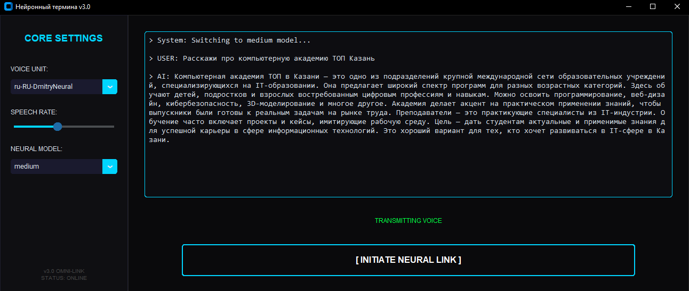

# 🌌 NEURAL TERMINAL v3.0

**NEURAL TERMINAL** — это футуристичный голосовой ассистент с двухпанельным интерфейсом, построенный на базе передовых нейросетевых технологий. 
Проект объединяет распознавание речи от OpenAI, интеллект Google Gemini и высококачественный синтез Microsoft Edge.

## ⚡ Основные возможности

* **Neural Link (STT):** Распознавание речи с помощью модели Whisper (поддержка `tiny`, `base`, `small`, `medium`, `large`, `turbo`).
* **Cognitive Core (LLM):** Использование Google Gemini 2.5 Flash для мгновенной генерации осмысленных ответов.
* **Voice Matrix (TTS):** Высококачественный синтез речи через `edge-tts` с возможностью выбора голоса и регулировки темпа.
* **Cyberpunk UI:** Современный интерфейс на `customtkinter` с боковой панелью настроек в реальном времени.



## 🛠 Архитектура системы

Приложение работает по принципу конвейерной обработки данных:

1. **Audio Capture:** Запись звука через `sounddevice` в формате 16кГц.
2. **Speech-to-Text:** Обработка аудиопотока моделью Whisper.
3. **Brain Processing:** Отправка текста в Gemini API с системными инструкциями.
4. **Clean & Speak:** Очистка ответа от Markdown-разметки и генерация аудио.

## 🚀 Быстрый старт

### 1. Требования

Убедитесь, что у вас установлен Python 3.12+ и **FFmpeg** (необходим для обработки аудио).

### 2. Установка зависимостей

```bash
pip install customtkinter google-genai openai-whisper edge-tts sounddevice soundfile numpy

```

### 3. Настройка API

Откройте `main.py` и вставьте ваш ключ доступа в переменную:

```python
API_KEY = "ВАШ_GEMINI_API_KEY"

```

### 4. Запуск

```bash
python main.py

```

---

## ⚙️ Настройки (Core Settings)

| Настройка | Описание |
| --- | --- |
| **Voice Unit** | Выбор между мужским (Dmitry) и женским (Svetlana) синтетическим голосом. |
| **Speech Rate** | Регулировка скорости речи (от -20% до +50%). |
| **Neural Model** | Переключение сложности модели Whisper (скорость vs точность). |

---

## 🎨 Интерфейс

Дизайн выполнен в стиле **Dark Cyberpunk**:

* **Акцентный цвет:** `#00d4ff` (Cyan)
* **Фон:** `#0a0a0c` (Deep Black)
* **Шрифт:** Consolas / Share Tech Mono

---

## 🤝 Разработка

Проект создан в образовательных целях для демонстрации интеграции различных нейросетевых API в единую экосистему на Python.

**Автор:** [Mikhail Derkunov/Giocatory]
**Организация:** Академия ТОП Казань
